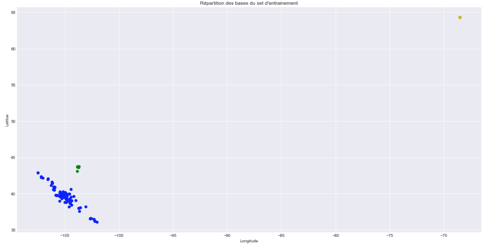
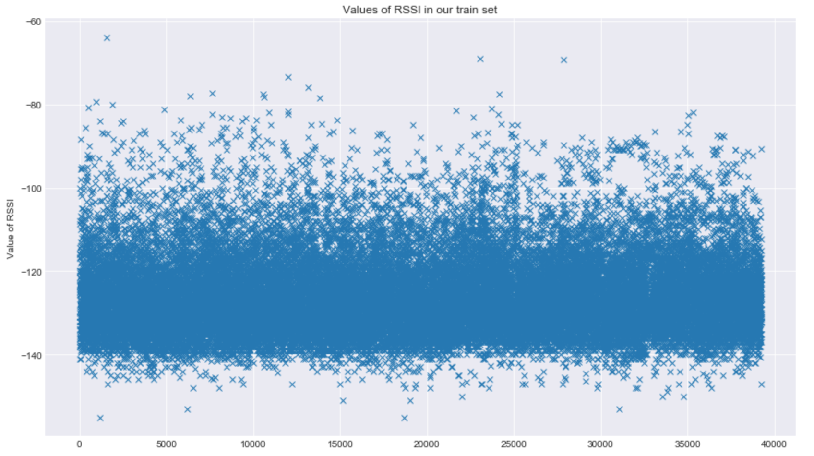
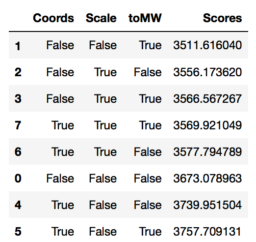

# Internet of Things

## Récupération des données
L'extraction des données se fait simplement sous Python via la librairie pandas. On dispose de 3 jeux de données. Deux jeux de données pour le train composés des différentes données géographique de base et de reception d'un message suivant une puissance définie et un jeu de test.

## Compréhension des données
Avant de nous lancer dans le traitement des données nous décidons de mieux les comprendre en utilisant des plots descriptifs.

#### Données géographiques
Notre problèmatique étant tournée vers des données géographiques, on commence par essayer de comprendre l'environnement dans lequel nous travaillons en represéntant en deux dimensions les données de latitude et de longitude de notre jeu d'entrainement.  
On comprend vite que notre jeu de données est distribué sur 3 points géographiques.

Après avoir tenté de mettre en place des algorithmes customisés selon les emplacements géographiques, nous avons décidé, faute de résultats et de données uniformément réparties, de généraliser notre travail autour d'un même et unique modèle.

#### La puissance en réception des signaux
On fait la même chose pour le RSSI.

On se rend compte que la majorité des valeurs de puissance en réception sont comprises entre -140 et -100 et que l'on compte quelques valeurs extrêmes pas nécessairement aberrantes.

## Traitement des données & Machine Learning
Une fois les données bien comprises, on s'est attaché au traitement et à l'apprentissage de ces dernières.  
De façon itérative, nous avons ajouté ou pas les coordonnées, converti ou non les données rssi décibels en mégawatts et mis à l'échelle l'ensemble de notre set.

</img>  
*À noter qu'on pourra trouver des valeurs différentes de celles du notebook à cause de la cross-validation*

Comme on peut le voir, le meilleur résultat sur les données de test a été obtenu en faisant uniquement la conversion des décibels en mégawatts.  
Pour autant il est légitime (mathématiquement) de penser que pour 50 mètres, le modèle 7 aura plus de sens en industrie à partir du moment où ce dernier scale les données.
La mise à l'échelle a été réalisée avec MaxAbsScaler de sklearn, fortement conseillé pour les bases sparses comme la notre.

Côté modèle, après plusieurs essais et une Gridsearch nous avons trouvé que le meilleur algorithme était celui des k(=3) plus proches voisins. Ce qui nous paraissait déjà logique avant l'implentation au vue de la problèmatique de distance et de la répartition des données (CF  *Compréhension des données*).

## Limites du modèle
Dans le modèle considéré, l’algorithme traite, pour chaque message, la puissance des signaux des bases qui l’ont reçu. Le label correspond à la position (latitude et longitude). Une information très importante n’est pas comprise dans le modèle, il s’agit de la position des bases. Ainsi, les resultats du modèle sont très dépendant de la ditribution de la position des messages. C’est à dire que dans le cas ou la plupart des points se situent quasiment au même endroit, le modèle aura non pas appris à donner la position du messages selon le signal reçu de chaque base, mais à donner une position qui est approximativement égale à la position de la majorité des points.  
Notre modèle fonctionne correctement dans ce cas puisque tous les messages ( à quelques outliers près ) ont une localisation proche. Prenons maintenant le cas où les messages proviennent de pays lointains. Le modèle perdra toute sa precision. Il est donc impératif de rattacher les puissances reçues à la position de chaque base. Ce modèle serait par consequent robuste à la variabilités dans les données. Mais, nous n’avons pas réussi à utiliser les données de localisation de base.

Par ailleurs, une optimisation de notre modèle porterait sur le calcul de l’erreur. En prédisant, une coordonnée GPS, puis la seconde. Nous avons été contraints de minimiser l’erreur sur chacune des coordonnées de facon indépendante. Or, il est évident que la minimisation successive de deux erreurs ne donnent pas le minimum de l’erreur sur les deux coordonnées.
L’implémentation d’un réseau de neurones, a permis de palier à cela étant donnée que l’on pouvait prédire les deux coordonnées simulatanément. Mais les résultats étaient mauvais, ce qui nous a contraint à revenir sur le modèle présenté.

### Auteurs
Baptiste Aubert  
Rémi Ferreira  
Badr Ghazlane  
Clément Tailleur
